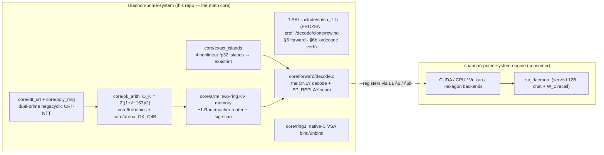

# shannon-prime-system — the math core

> **The clean, engine-free discrete-inference substrate of [Shannon-Prime](https://github.com/nihilistau/shannon-prime-lattice).**
> A from-scratch C library (`libshannonprime`) exposing a **frozen Layer-1 C ABI** plus the
> exact-integer discrete-algebra primitives (`O_K = Z[(1+√−163)/2]`, dual-prime CRT-NTT,
> Frobenius lift, Spinor block, KSTE, the two-ring KV memory) that every engine backend shares.

**Status tiers** (used throughout, never inflated):
`[PROVEN]` gated with receipts (commit/gate cited) · `[WIRED]` built + in-tree + primitive-gated · `[gated-GREEN]` passes its gate behind a default-off flag (null floor when unset) · `[DESIGN]` spec only · `[HONEST-NEGATIVE]` measured + refuted, kept on the record.

**The thesis (one line):** *position is arithmetic.* The substrate computes exactly in the
ring of integers `O_K = Z[(1+√−163)/2]` over a dual-prime negacyclic CRT-NTT. The payoff is
**EXACT-INTEGER arithmetic = cross-machine determinism = auditability** — **not** compression.
Every "structure-on-content" compression lever this project tried is a measured honest-negative
(see [§7](#7-boundary-thesis--honest-negatives)).

- **Consumed by** [shannon-prime-system-engine](https://github.com/nihilistau/shannon-prime-system-engine) as the git submodule `lib/shannon-prime-system/`. Every accelerated backend (CPU AVX2/AVX-512, CUDA, Vulkan, Hexagon HVX) registers against this library's L1 ABI; the scalar reference forward here is the bit-exact correctness anchor each backend gates against.
- **Public results** (receipts-first papers + `LEDGER.md`): [Position Is Arithmetic](https://github.com/nihilistau/Position_Is_Arithmetic) (live: https://nihilistau.github.io/Position_Is_Arithmetic/).
- **Ground-truth project state:** lattice `papers/PPT-LAT-STATE.md` (the proven record) + `papers/PPT-LAT-Theory.md` (the math).

License: **MIT** (`LICENSE`).

---

## Navigation

| You want… | Read |
|---|---|
| Agent entry + read-order + pre-flight | **[`AGENTS.md`](AGENTS.md)** |
| This repo's specifics + non-negotiables | **[`CLAUDE.md`](CLAUDE.md)** |
| Commit history (hashed Tier-0 LUT) | **[`HISTORY.md`](HISTORY.md)** |
| Module conventions (before adding a module) | **[`CONVENTIONS.md`](CONVENTIONS.md)** |
| The proven record / the math | lattice `papers/PPT-LAT-STATE.md` / `papers/PPT-LAT-Theory.md` |

---

## 0. Where this repo sits — the rings + XBAR

XBAR (the **auditable latent crossbar**, lattice `RFC-XBAR`) is the system this substrate
serves: an **Exec** (the big generator — the engine's CUDA/CPU forwards) and a **Memo** (a small
curator) share a tiered latent memory, and every write to canonical memory is receipted, gated,
and rewindable. **This repo owns the substrate tiers** (Ring 1 + Ring 2 + the curator transaction
+ the `SP_REPLAY` seam + the exact-integer container they sit on). The engine owns Exec's
accelerated forwards, the Optane/QUIC Ring-2 stores, the `SP_XBAR_*` harness, and the daemon.



The recall-relevance problem the ARM contract posed — *which stored episode is load-bearing for
this query?* — is **SOLVED**, but **the live selector itself lives host-side in the engine daemon**
(`recall.rs`/`routes.rs`); **NO frozen-ABI change and NO `.sp-model` format change** — the L1 §6b
verb and the OK_Q4 container are untouched. This core owns the episode store (`core/arm/`) + the
exact-integer substrate it rides on; the selector is an engine-side rider. Detail in [§5](#5-the-recall-organism-where-the-pieces-live).

---

## 1. The frozen L1 ABI (`include/sp/sp_l1.h`)

The L1 ABI is **frozen** (tag `lat-phase2-contract-frozen`). Growth is **append-only** — values
never renumbered, fields appended in reserved tails. Two opaque types cross the FFI:

```c
typedef struct sp_model    sp_model;     // read-only after load; many sessions per model
typedef struct sp_session  sp_session;   // single-thread state: KV + ARM + sieve + arch scratch
```

Core verbs:

```c
sp_status sp_prefill_chunk(sp_session*, const int32_t *toks, size_t n, float *logits_last, size_t cap);
sp_status sp_decode_step  (sp_session*, int32_t token, float *logits, size_t cap);
sp_status sp_session_clone (const sp_session*, volatile int *cancel, sp_session **out);   // spec-decode fork
sp_status sp_session_rewind(sp_session*, size_t n_tokens);                                 // O(1) reject (journaled)
sp_status sp_session_position(const sp_session*, size_t *pos_out);
```

### Backend registration hooks

| § | Verb | What it owns |
|---|---|---|
| **§6** | `sp_session_register_forward_backend(s, handle, fn)` | A full forward pass (PREFILL / ppl-style; re-runs the whole forward over accumulated history). `[PROVEN]` (sprint WIRE-HEX). |
| **§6b** *(additive)* | `sp_session_register_kvdecode_backend(s, handle, dt)` | A **STATEFUL, session-resident KV decode** — `sp_kvdecode_dispatch_fn` = `open / prefill / decode_step / rewind / position / close` over one device-resident cache. When registered, `sp_decode_step` routes the single-token call to `dt->decode_step`. The engine's CUDA `gemma4_kv_decode_logits` registers here so the universal daemon drives the 12B token-by-token (engine gate `G-WIRE-CUDA-DECODE-GEMMA4`: 32/32 == oracle, VRAM O(1)). Append-only — **no frozen surface renumbered**; an unregistered session is calloc-zero = byte-compatible with every existing consumer. `[WIRED]` (commit `d9d96f3`). |

**§6c / §6d / §6e — registered-here-but-engine-resident knobs** (CONTRACT-CHAT-FULLSTACK B1/B2/B5,
commits `307fdf2` / `4cc0ebd` / `cb601e9`). These are **NOT new frozen `sp_session` verbs** — they
are **backend-internal runtime knobs** on the resident KV-decode handle (the engine's `sp_g4_kv*`
behind the §6b dispatch table), registered in this header **first** per the contract's ABI rule but
implemented as engine symbols (they toggle device-side CUDA-gemma4 state the math-core does not
model). All default-off = byte-identical null floor:
- **§6c** auditable-mode byte-exact toggle (routes the resident decode through the exact-integer islands + dual-prime attention → run-to-run bit-identical).
- **§6d** XBAR SWA W-slot ring (O(1)-context KV) + episode `SP_REPLAY` recall into a live turn (O(1) `gemma4_kv_rewind` inverse).
- **§6e** the single latent entry seam — one residual input, three sources: TEXT (`inject_tokens`, bit-identical to prefill by construction), AUDIO/MEMORY (`inject_frames`).

### Other frozen surfaces

| Header | Purpose |
|---|---|
| `include/sp/exact_islands.h` | The 4 nonlinear fp32 islands (RMSNorm / softmax / GELU / RoPE) as exact-integer references; RoPE via deterministic fixed-point CORDIC (no libm). Anchor for the engine's `SP_BYTEEXACT` forward. Gate `T_EXACT_ISLANDS`. |
| `include/sp/sp_status.h` | `sp_status` enum (SP_OK … SP_EHVX) + thread-local `sp_last_error()`. **Frozen — values must not be renumbered.** The discrete-algebra codes (−20..−26) are the "lost the algebraic invariant" surface. |
| `include/sp/sp_model.h` | `.sp-model` / `.sp-tokenizer` on-disk format. `sp_model_load` is pure `mmap` + header parse — zero malloc proportional to tensor data; the file IS the in-memory layout. |
| `include/sp/ntt_crt.h` | Dual-prime negacyclic NTT over `Z_q[x]/(x^N+1)` with Barrett reduction. Frozen primes (below). `N ∈ {128,256,512}`. |
| `include/sp/poly_ring.h` | `sp_pr_init/_inner/_mul/_attention`. Attention `⟨q,k⟩` = coefficient 0 of negacyclic `q ⊗ k*`, **exact in `Z`** when `\|⟨q,k⟩\| < M/2`. |
| `include/sp/frobenius_lift.h` | Per-row int8 codes + per-row fp32 scale; symmetric `[−127,127]`, round-half-away-from-zero, deterministic across FP modes. |
| `include/sp/arena.h` | The packed-weight arena (single in-RAM layout for Q8 / Q4 / **OK_Q4B** mixed-precision). |
| `include/sp/spinor_block.h` | The **frozen** 63-byte VHT2 + Möbius KV record + CRC-8 trailer (wire format is the struct). |
| `include/sp/kste.h` | Deterministic 64-byte packed-tree fingerprint (`T_{60,3}`), Tier-0/Tier-1 dominance. |
| `include/sp/arm.h` | The two-ring recall router: ±1 Rademacher projection, signature scan, Ring-2 backend ABI, hits telemetry, cold-evict mask, per-layer-class geom API. |
| `include/sp/ok_int.h` | `O_K = Z[(1+√−163)/2]` integer arithmetic. |

Growth discipline for `sp_arch_info` lives in the §2 comment block of `sp_l1.h` (append fields in
the reserved 256-byte arch-struct tail; loader memcpies `min(arch_struct_size, sizeof(sp_arch_info))`
so old files leave new fields zero — the "unspecified" sentinel).

---

## 2. What lives in `core/`

The scalar reference forward here is the **bit-exact correctness anchor** — a discrete `Z_q`
forward proven **argmax bit-exact to llama.cpp** on five architecture families: Qwen3-0.6B,
Qwen2.5-Coder-0.5B, Gemma3-1B, **Gemma4-E2B**, and **Qwen3.6-35B-A3B MoE (Gated DeltaNet)**.

| Module | Status | Notes |
|---|---|---|
| `core/forward/decode.c` — the **only** decode in the tree (`generate_kv_impl`; `qwen3_generate_kv` / `qwen3_ppl_decode`) | `[PROVEN]` | two-ring KV + NTT-KV fusion + the `SP_REPLAY` episode-replay seam (off-path bit-exact, gate `T_GENKV_REPLAY_NULL` 34/34). `core/forward/gemma4.c` is forward-only (decode/ring is engine-side P3). |
| `core/arm/` — the two-ring KV memory + ARM recall router | `[PROVEN]` | ±1 Rademacher projection + bit-packed signature scan, recall-hit telemetry (`sp_arm_hits_*`), cold-evict mask (`sp_arm_evict_*`), abstract Ring-2 backend ABI, per-layer-class geom API (`sp_arm_*_geom`, gate `T_ARM_GEOM` 26/26 uniform-null bit-identical). Gates `T_ARM`, `T_ARM_SIG`, `T_ARM_GEOM`, `T_ARM_GENKV`. |
| `core/exact_islands/` — the 4 nonlinear fp32 islands as exact-integer references | `[PROVEN]` | RMSNorm / softmax / GELU / RoPE (RoPE via fixed-point CORDIC, no libm). Gate `T_EXACT_ISLANDS`. The math-core anchor for the engine's `SP_BYTEEXACT` byte-exact forward — the **auditability** axis, NOT compression. |
| `core/ntt_crt/` + `core/poly_ring/` — dual-prime CRT-NTT + R_q attention | `[PROVEN]` | byte-exact negacyclic NTT, `N ∈ {128,256,512}`; production path uses **no 128-bit type** (`T_NTT_5` guard). |
| `core/ring3/` — native-C Ring-3 VSA bind/unbind + NIGHTSHIFT consolidation | `[PROVEN]` | gate `T_RING3_NATIVE` GREEN (commit `e0fccd3`); the C `core/`-resident port of the Ring-3 bind that was host-Python on this repo's primitives. |
| `core/frobenius/` + `core/arena/` — Frobenius-lift Q8/Q4 codec + **arena layout v2** | `[PROVEN]` | optional per-32-block f16 `bscale` for the **OK_Q4B** codec (`bscale == NULL` preserves v1 exactly). Carries the gemma-4-12B artifact. |
| `core/vht2/` — the **frozen** 63-byte Spinor block | `[PROVEN]` | VHT2 + Möbius reorder + CRC-8; `0xA5` sentinel; tests `T_VHT_3/5/6` guard the contract. |
| `core/kste/` — packed-tree fingerprint encoder | `[PROVEN]` | 64-byte `T_{60,3}` tree, Tier-0/Tier-1 dominance. |
| `core/ok_arith/` — `O_K = Z[(1+√−163)/2]` integer arithmetic | `[PROVEN]` | |
| `tools/curator/` — the Ring 2′ curator transaction | `[PROVEN]` | propose → gate → atomic-promote / rewind, append-only receipts; episode persistence + router re-projection determinism. C1-lite COMPLETE (tag `xbar-c1-lite-complete`; cold-evict `T_GENKV_COLD_EVICT` 45/45). |
| `core/forward/` — qwen3 / qwen25 / gemma3 / gemma4 / qwen35moe reference forwards | `[PROVEN]` | argmax bit-exact per family. |
| `core/sieve/` — Friedman-Kruskal dominance sieve | `[WIRED]` | in progress (Phase 5+ feature, off by default). |
| `.sp-model` reducing codec (`OK_Q4` / `OK_Q8`, body ≤ source quant) | `[PROVEN (C1)]` | output-lossless top-1 == oracle (gemma4 + qwen35moe; qwen35moe 16.33 GB < 19.7 GB source). |
| N0/N1 **diffusion-gemma** arch + loader (`sp_model_to_diffusion_gemma`) | `[WIRED]` | `SP_ARCH_ID_DIFFUSION_GEMMA`, gate `G_DG_N1` loader 26/26 (commits `add876e` / `b1fae37`). Loader-only; not on any served path. |

### Frozen primes & constants (`include/sp/ntt_crt.h`)

| Constant | Value |
|---|---:|
| `SP_NTT_Q1` | `1073738753` |
| `SP_NTT_Q2` | `1073732609` |
| `SP_NTT_M` (= `q_1·q_2`) | `1152908312643096577` |
| Garner `Q1_INV_MOD_Q2` | `894602413` |
| Admissible `N` (direct NTT) | `{128, 256, 512}` |
| Admissible `N` (Bluestein) | all powers of 2 ≤ 512 |

Both frozen primes have 2-adic valuation `v_2(q−1) = 10`, so `N > 512` is mathematically
impossible with this pair (`M ≈ 2^60` fits `uint64_t` → no `__int128`). Long-context NTT
(ctx ≥ 1024) is done via **tiled `N=512` transforms**. A third prime to extend `N` is filed as
`Phase 4-NTT-PRIME-EXTENSION`.

---

## 3. Headline status (verify, don't assume)

**`[PROVEN]` — the forward + substrate.** The discrete forward is argmax bit-exact on **5 arch
families** (through the 35B-A3B Gated-DeltaNet MoE); the reducing `.sp-model` codec is
output-lossless and smaller than source (C1); the NTT-CRT / Frobenius / Spinor / KSTE primitives
are all shipped + gated. Citable engine envelope numbers (lattice `LEDGER.md`): gemma-4-12B
**26.1 tok/s @ wikitext PPL 5.12 on one RTX 2060-12GB** (06-R10); the gemma-4 GGUF ecosystem ships
broken weights (gold forward PPL 4.68 vs GGUF 192–506) → **safetensors-direct is the only trusted
weight path** (the GGUF lane is dead); two-ring **910× resident-KV shrink @32k, 8× sparsification
@ +0.69% PPL** (512-proven). **`[HONEST-NEGATIVE]` the 32k NIAH MISSed** — kept on the record.

**`[gated-GREEN] / default-off` — the byte-exact forward, anchored here.** Byte-exact =
**exact-integer arithmetic / cross-machine determinism** (the AUDITABILITY mission), explicitly
**NOT** compression. The dual-prime linear algebra was already bit-exact-gated in the engine's L2
crate `tools/sp_dsp_smoke` (Barrett / mod-q matmul / Garner inv=`894602413` / NTT). The
genuinely-new piece in **this** core is `core/exact_islands/` (the 4 islands as exact-integer refs)
+ the L1 §6b kvdecode verb. On the engine side these carry the default-off `SP_BYTEEXACT`
device-integer forward: **engine gate `G-BYTEEXACT-FORWARD-12B`** — OFF = PPL 4.6665 byte-identical
null floor / ON = 4.6569 parity / **run-to-run bit-identical**. Math-core commit `d9d96f3`, engine
`69c0588`. **HONEST CAVEATS:** the one remaining item is EXTERNAL — a bit-identical logit check
across two **physical** GPUs (on-machine we have run-to-run determinism + reduction-order immunity
as the proxy); PPL parity measured at n=42 (small-N, the −0.21% deflection is within noise).

**`[gated-GREEN]` — XBAR memory unified onto this repo's exact-integer O_K substrate.** The whole
memory stack was re-carried off generic float carriers onto these primitives (dual-prime
negacyclic CRT-NTT + `O_K` arithmetic + Frobenius lift): Ring-3 VSA bind **256/256 bit-identical**
to native `sp_pr_mul`/`ntt` and **reduction-order-immune** (M byte-identical across permutations vs
float 4.44e-15 drift) — `G-R3-BIND-on-O_K`; a Frobenius π^k integer Ring-2 episode store
(`G-R2-FROB`); the full real-episode organism loop (`G-XBAR-ORGANISM-FULL`). The native-C `core/`
port of the bind landed here as `core/ring3/` (`T_RING3_NATIVE`). The **T4 Frobenius π^k of the
9.4GB model weights** is the next core-side lever (validated, untouched).

> **Update 2026-06-20 (cross-repo, host-side):** the two-ring memory this core provides now has a
> DEPLOYED autonomous recall head live on the served Gemma-4-12B chat — a learned **W_c** selector
> (logsumexp-mean relevance, (E+1)-NULL argmax, bounded M=42 replay). It is **entirely engine-side**
> (`recall.rs`/`routes.rs`, engine `edc8079`) — **NO frozen-ABI change, NO `.sp-model` format
> change.** This core owns the episode store + substrate; the selector is a host-side rider. See
> [§5](#5-the-recall-organism-where-the-pieces-live).

---

## 4. Build

**Build truth is pinned in the engine repo:** `shannon-prime-system-engine/docs/BUILD-ENV.md`.
Summary: the canonical CPU build is **MinGW gcc 15.2** in `build/` (Ninja); **MSVC cannot build the
CPU tree** (GCC `__attribute__((target))` + `<stdatomic.h>`; Tier-3 MSVC parity deferred). VS2019
BuildTools is the CUDA *host* compiler only.

```bash
cmake -B build -G Ninja -DCMAKE_C_COMPILER=gcc
cmake --build build
ctest --test-dir build --output-on-failure
```

Single-module fast iteration (each `core/<m>/` is self-contained with its own `CMakeLists.txt`):

```bash
cmake -B core/ntt_crt/build -S core/ntt_crt -G Ninja -DCMAKE_C_COMPILER=gcc
cmake --build core/ntt_crt/build
ctest --test-dir core/ntt_crt/build --output-on-failure
```

Run once with `-DSP_UBSAN=ON` before closing a module. The root build is **EXISTS-guarded** —
`SP_MODULES` lists every module but skips any whose directory isn't present, so parallel agents can
drop in `core/<m>/CMakeLists.txt` without ever editing the root. Read `CONVENTIONS.md` before adding
a module.

**Sync discipline (binding):** this repo is **also** carried as the engine's
`lib/shannon-prime-system` submodule, so the two checkouts can diverge. Both track the same
`origin/main`. **`git fetch` + check `git rev-list --count HEAD..origin/main` BEFORE any build or
commit;** every standalone commit is followed by a submodule bump in the engine.

---

## 5. The recall organism — where the pieces live

The "which episode is load-bearing?" relevance problem the ARM contract posed is **SOLVED**, but the
solution is split cleanly:

- **This core owns** the episode store (`core/arm/` Ring-2 + the ARM router) and the exact-integer
  substrate it rides on.
- **The engine owns** the live selector. The fix is three host-side pieces (engine, default-off,
  null-floor): a **curator** (mints novel, non-parametric needles); a **teacher-forced ablation
  labeler** (`SP_B3_SECRET` cudaMemset-ablates the secret's source KV rows and re-scores the
  secret's NLL — novel needle collapse **−33.56** vs parametric control **−0.15**, ~16-nat gap,
  pinned **TAU=−8.0**, the official ADMISSION oracle); and a **learned `W_c` head** trained on those
  labels (the live RECALL selector). Engine gate `G-CHAT-B3-WC-DIV2` = 360/361 recall + 50/50
  foreign-reject (int16==f32, s0=+0.102); LIVE `G-CHAT-B3-WC-DEPLOY`, engine `edc8079`.

**Architecture, fixed + recorded:** the **causal ablation oracle (TAU=−8) is the ADMISSION gate**;
the **learned W_c head is the live RECALL selector**; the native **Diffusion Judge is UNPROVEN, in
the drawer** pending an OOD kill-test (its 95.6% is the *external* llama.cpp oracle's number, not
ours — the native single-forward was falsified ~25%; it must beat W_c head-to-head before earning
deployment).

This rides entirely on this repo's two-ring substrate but is an **engine-side rider** — the L1 §6b
verb and the OK_Q4 `.sp-model` container are untouched. Detail: lattice `CONTRACT-CHAT-FULLSTACK` +
`SESSION-HANDOFF.md §0d`.

---

## 6. How math-core relates to the backends

Math-core's forward path is the **reference** — bit-exact, scalar where possible, deterministic.
Every backend in `shannon-prime-system-engine/src/backends/` is a *replacement* for some slice of
that reference, validated against it via a byte-exact gate (`T_*_BIT_EXACT`). Three registration
shapes:

| Shape | API | Use when |
|---|---|---|
| **Full forward** | `sp_session_register_forward_backend` (§6) | Backend owns the entire forward pass (PREFILL). |
| **Persistent-KV decode** | `sp_session_register_kvdecode_backend` (§6b) | Backend owns a stateful session-resident KV decode (`open/prefill/decode_step/rewind/position/close`). The engine's CUDA `gemma4_kv_decode_logits` registers here. |
| **NTT dispatch** | `sp_pr_bluestein_set_backend` | Backend owns just the inner residue NTTs (e.g. cDSP via FastRPC). Routes through the polynomial-ring attention overlay. |

---

## 7. Boundary thesis — honest negatives

`O_K` wins on **EXACT ARITHMETIC (the container)**; every structure-on-*content* lever was
measured-inert and is kept on the record as an `[HONEST-NEGATIVE]` (do not re-litigate):

- Split-prime `O_K` Dirichlet carriers (`d7d96fe`) — operationally inert.
- Möbius-on-M (`1e70763`) — sheds memories 1.000 → 0.969 @ N=32.
- Entropy-coding the Frobenius codes (`e6d17bb`) — 1.02× dead weight (the lever is bit-width).
- T2-Möbius on the real 12B embedding (`ac76c8e`) — recon cos 0.032 == random.
- The compression reading of "byte-exact" — convicted redundant against the existing per-32-block OK_Q4B at gold PPL 4.6665. Byte-exact is the **auditability** axis only.
- NTT-attention is **slower** than fp32 dot at HD ≤ 256 (~0.15–0.72×); the substrate win is over HD (poly length), not ctx.
- KSTE is **not** a recall router (histogram = permutation-invariant; the directional ±1 Rademacher projection is the router). KSTE stays valid for dedup/dominance only.

---

## 8. License

MIT. See `LICENSE`.
